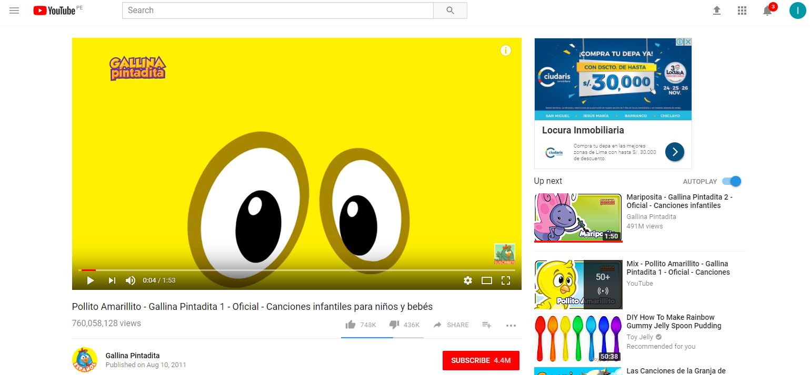

# **RETOS: Intro a UX Design**

### **Parte 1**

Para este reto se nos pide que elijamos una página web de entre tres proporcionadas. Tenemos que explicar qué partes conforman el UX y qué partes el UI

A continuación procederé a listar las partes del UX y las del UI de la página de _youtube_.

> **UX:**

* Ubica el logo en la parte superior izquierda de la página y justo a su lado se ubica la barra de búsqueda. 

* En el lado superior derecho ubica la sección de _log in/sign up_ y menus desplegables para que esten a la altura de la vista del usuario.

* Ubica una barra con menus lo largo del margen izquierdo.

* Hace que se muestren las últimas repoducciones del usuario en la página de inicio de su sección. También le muestra sugerencias acorde a lo último que ha reproducido. A lo largo de esta página de inicio de su sesión, muestra videos recomendades, hace mix de videos acorde a sus gustos, le muestra más videos de los canales que ya visitó, le sugiere canales acorde a sus gustos, le muestras los videos y canales más populares.

* Se asegura de que el usuario tenga en un primer vistazo de donde escoger y así asegura de que este no abandone el portal.

* Da opciones para la calidad del video que pueden ir desde automático dependiendo de la velocidad de internet del usuario hasta HD.

* Se dan opciones también de autoplay, de anotaciones y de velocidad para que el usuario escoja cómo quiere ver el video.

* Hace que el usuario pueda escoger ver el video en diferentes modos: el _default_, el _theather mode_ y _full screen_.

* Hace que el usuario pueda ver el avance la carga de de su video, de ver en qué minuto se enuentra, poder elegir en qué minuto quiere ubicarse y que tenga la posibilidad de hacer _pausa_ y _stop_.

* Determina la posición de la página donde se ubicará la publicidad.

* Es parte de la toma de decisión sobre en qué minuto (o minutos) del video se mostrará publicidad: antes, durante o nunca.

> **UI:**

* Se encarga de darle diseño y color al logo y de armonizar toda la página de acuerdo a estos colores: color de botones, de menus, de fuente de letra, de aviso de notificaciones, de identificación del usuario.

* Escoge el tipo o los tipos de fuentes de letra a usar.

* Le da funcionalidad a los botones y menus sugeridos por el UX designer. Crea los menus desplegables y hace la forma de _sign up_, _log in_ para el usuario.

* Le da funcionalidad a las funciones de carga y de visualización de minutos del video.

* Le da funcionalidad a la sección de subtítulos, autoplay, anotaciones, velocidad y calidad del video.

> **Página de Inicio**

> **Reproduciendo un video**

